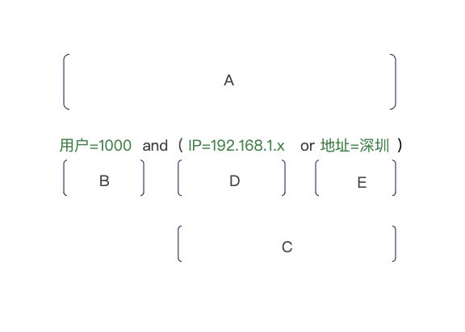
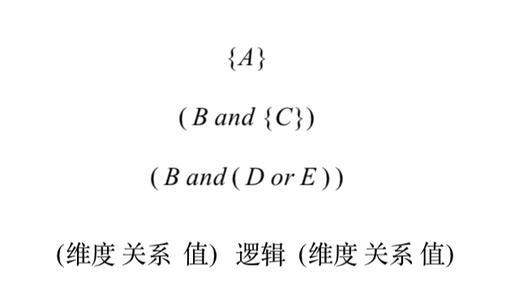
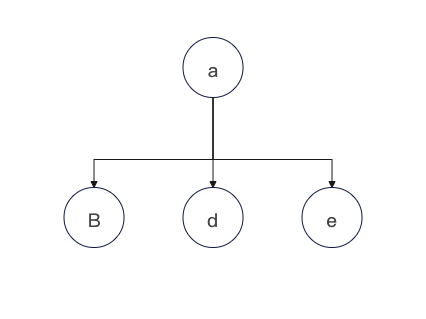
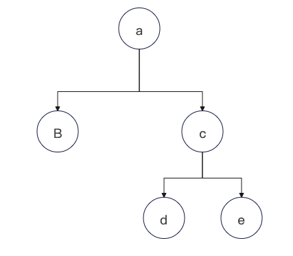
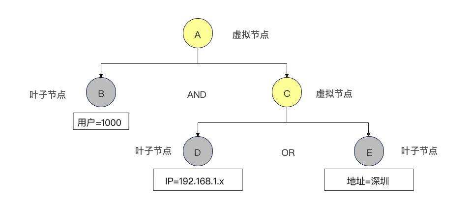

# 表达式引擎设计

## 目录

*   [背景](#背景)

*   [基本概念和数据结构](#基本概念和数据结构)

    *   [表达式](#表达式)

    *   [节点](#节点)

    *   [节点存储和遍历](#节点存储和遍历)

        *   [前序遍历](#前序遍历)

        *   [中序遍历](#中序遍历)

        *   [后续遍历](#后续遍历)

    *   [数据结构设计](#数据结构设计)

*   [表达式解析和校验](#表达式解析和校验)

    *   [优先级](#优先级)

## 背景

在BNC的开发过程中，我们常常需要针对一部分流量进行限制性访问，比如

*   新功能上线，灰度访问

*   黑白名单功能，限流，安全校验

*   广告投放规则

*   用户标签打标

*   大促玩法规则

其本质上是一种规则的判定逻辑，如果我们可以设计出一套规则引擎，可以解析并校验，那么这样一套独立的引擎可以适用于以上的任一系统，完美的提升了人效。

## 基本概念和数据结构

在讨论如何具体设计之前，我们先了解下，我们可能会遇到的数据结构。

### 表达式

假设我们有以下表达式内容，描述的是一条表达式为:当用户为1000 并且 用户的登录地址为深圳或者ip为192.168.1.x的时候，为true，否则为false

如果我们采用SQL语法描述，那么大致上可能是这样的:

```json
用户=1000 and  ( IP='192.168.1.x' or 地址='深圳' )
```

但是对于程序来言，如何解析这段文字，并进行规则匹配是关键

***

### 节点

接下来，我们先将表达式进行拆分，并用一定的标准属于去约束和定义拆分出来的个体



我们将表达式整体当做A，在A内部，我们才成两个大块B and C ，而在C的内容 则是D or E,拆分的规则也就是我们程序解析字符串表达式的规则

*   【关系符】左边(👈🏻)为维度，右边(👉🏻)为值

*   【逻辑符】AND 的优先级大于 OR

*   【逻辑符】（）的优先级大于AND ，碰到 '(' 则括号内的当做一个整体，也就是虚拟节点: *(PS：稍后讲解虚拟节点)*

综上:拆分的规则就是 按照逻辑符 AND、OR、（）进行拆分，关系符=、≠、≥、≤等进行拆分

最后，我们得到以下表达式展示



最终，实际上我们真正用到的表达式只有B、D、E 。 A和C其实只是为了形象表达和预占位而用的，在真正程序运算的时候，该占位符会被最终替换为D和E，因此我这里用{}来表达占位符。并且，为了更好的表达一个表达式，我们将类似：$用户=1000$ 这种拆分为

*   \*\*维度 \*\*等于 用户

*   \*\*关系符 \*\*等于 =

*   \*\*值 \*\*等于 1000&#x20;

*   **逻辑** 等于 AND

### 节点存储和遍历

有了以上表达式的拆分规则和基本的语义定义之后，我们就要想如何用计算机的语言去表达和存储。我们再来看这张图不难发现


任何一个表达式，都可以被形象展示为一个**树状结构**

1.  假设我们的表达式是 $fx(b+  d + e )$ *Note: +代表 逻辑AND ，| 代表逻辑或*

    1.  那么我们的树状结构可以被描述为 以a为根节点，b、d、e 为三个子节点的一棵树 （多叉树）

        

2.  假设我们的表达式是 $fx(b+  （c | d） )$ *Note: +代表 逻辑AND ，| 代表逻辑或*

    1.  那么我们的树状结构可以被描述为 以a为根节点，b为左子树，以c为右子树，c下有d和e （二叉树）

        

为了方便运算和最简单化处理，我们统一用二叉树的形式来存储和遍历整个表达式。最终我们看下数据结构展示



我们依然用数据结构中树的术语去描述

*   为了补充树的完整性和更好的去遍历整个表达式，以及表示预占位这个概念，我们引入了虚拟节点，用黄色标识

*   如果说虚拟节点代表的是不存在的，并且是**组合节点**的话，那么**叶子节点**就是其下不再有任何子节点，用灰色标识

*   每个节点不仅仅存自己的表达式内容，而且还包含了其下的左右子节点，但我们仍需区分对待虚拟节点和叶子节点

    *   虚拟节点

        *   因为真实不存在，所以没有数据内容，只有左和右，以及用于描述两者的关系的逻辑符

    *   叶子节点

        *   真实存在，拥有自己的表达式内容，正如: 用户=1000 一样，这就是他的表达式内容，并且维度=用户，值=1000，关系是=

        *   叶子节点是最终节点，所以不再有左和右

        *   叶子节点才是最终参与表达式运算的节点

最后，我们用一张图表来对比两者不的不同

| 属性功能    | 虚拟节点             | 叶子节点 |
| ------- | ---------------- | ---- |
| 名称      | ✅                | ✅    |
| 是否是虚拟节点 | ✅                | ❌    |
| 是否是叶子节点 | ❌                | ✅    |
| 表达式内容   | ✅                | ✅    |
| 维度      | ❌                | ✅    |
| 关系      | ❌                | ✅    |
| 值       | ❌                | ✅    |
| 逻辑      | ✅                | ❌    |
| 左节点     | ✅                | ❌    |
| 有节点     | ✅❌ *PS(右节点不一定有)* | ❌    |

当一个节点被设计出来之后，我们仍然要考虑，作为计算机，其如何将一种树状结构线性化存储，并且可以反序列为树状结构从而被可视化和可解读。

存储的结构和顺序 取决于我们怎么去解析和评价表达式。我们首先知道一个重要准则

> 📌**参与计算的只有叶子节点，虚拟节点只是作为用逻辑运算符组合（拼接）子表达式存在**

而我们作为人类，面对一个组合表达式的校验规则往往是

> **先校验****第一个****表达式，然后校验****第二个****，如果第一个是个组合表达式，那么就先将第一个表达式****完全校验****，之后再校验第二个**

> 📌**这里的第一个，其实指的是左节点，第二个是右节点，完全校验，指的就是递归校验**

大家想到这里，是否有想到这和树的遍历顺序有很大的相似性，对的，表达式评价顺序其实和树的遍历顺序是一致的。

<https://blog.csdn.net/google19890102/article/details/53926704#:~:text=%E4%BA%8C%E5%8F%89%E6%A0%91%EF%BC%88Binary%20Tree%EF%BC%89%E6%98%AF%E5%8C%85%E5%90%AB,%E5%AD%90%E6%A0%91%E7%9A%84%E4%BA%8C%E5%8F%89%E6%A0%91%E7%BB%84%E6%88%90%E3%80%82>

这里我贴一下，二叉树的遍历方法，方便感兴趣的同学复习

常见的树的遍历方法有 前序-中序-后续，我们分别看遍历后的结果是否方便我们进行存储和阅读

我们还是以 这个表达式为样本


#### 前序遍历

```java
{A}  B  {C}  D   E  
```

此时，我们将占位符换成逻辑运算符

```java
AND B OR  D   E  
```

em... 似乎看不懂这个表达式要表达什么

#### 中序遍历

```java
B  {A}  D  {C}  E 
```

此时，我们将占位符换成逻辑运算符

```java
B  AND  D  OR  E 
```

OK ,在不考虑逻辑表达式'()'的情况下，我们会认为 这种语法至少人类是可以看懂的，虽然，现在的理解依然是错误的，单至少进步了很多

#### 后续遍历

```java
B  D  E  {C}  {A}
```

此时，我们将占位符换成逻辑运算符

```java
B D E  OR  AND 
```

依然，我们不知道这句话想要表达什么

综上，我们看到三种遍历方式，最符合人类自然语言和理解是中序遍历，只要我们在虚拟节点C上附带逻辑'()'就可以完成表达式的自然语言序列化，最终，我们将此以方式存储和读取表达式内容

### 数据结构设计

接下来，我们看下如何用程序语言去描述我们的节点结构，还是以表达式为例

```json
用户=1000 and  ( IP=192.168.1.x or  地址=深圳 )
```

结合对上面对节点内容结构分析，我们定义大致结构如下

```json
{
    "leaf": false,
    "logicExpression": {
        "val": " AND "
    },
    "left": {
        "leaf": true,
        "relationExpression": {
            "dimensionExpression": {
                "val": "用户"
            },
            "val": "用户=1000",
            "valueExpression": {
                "val": "1000"
            }
        }
    },
    "right": {
        "leaf": false,
        "logicExpression": {
            "val": " OR "
        },
        "left": {
            "leaf": true,
            "relationExpression": {
                "dimensionExpression": {
                    "val": "IP"
                },
                "val": "IP=192.168.1.x",
                "valueExpression": {
                    "val": "192.168.1.x"
                }
            }
        },
        "right": {
            "leaf": true,
            "relationExpression": {
                "dimensionExpression": {
                    "val": "地址"
                },
                "val": "地址=深圳",
                "valueExpression": {
                    "val": "深圳"
                }
            }
        }
    }
}
```

如果用java语言描述一个Node的结构我们可以这样描述

```java
public class ExpressionNode implements Expression {

    /**
     * 是否是叶子节点，叶子节点是单个表达式的最小单位，包含了维度和值，以及基本的关系比如 = != 等等
     */
    private boolean leaf;

    /**
     * 关系表达式，包含了维度和值，注意 如果是虚拟节点，则此值不存在,只有叶子节点才有
     */
    private RelationExpression relationExpression;

    /**
     * 逻辑关系，包含了基本的是AND 还是 OR 还是( ) ,注意如果是叶子节点，则此值不存在
     */
    private LogicExpression logicExpression;

    /**
     * 左节点
     */
    private ExpressionNode left;

    /**
     * 右节点
     */
    private ExpressionNode right;
    
 }
```

接下来，我们分析如何将这些规则数据存储到DB，并如何做到方便快速的检索

一组表达式其实就是一条规则，我们遇到的挑战主要有:

1.  规则的维度和值的类型是多样的，而一张表的结构和属性定义是唯一的。

    1.  比如维度可以是用户、IP、地址、Tag标签、请求头、年龄、等等。而值类型可以是单值、列表、布尔、字符串、数字类型等。如果我们将维度抽象成为列，但是列在多数情况下不变的，不可能因为增加了一个维度，而增加一列。

2.  规则的存储的重要原则是方便可检索，可索引。

    1.  鉴于规则多数用于流量的匹配校验，因此它的实时性和快速性很重要，快速检索的条件之一就是索引规则，如果我们将一整串规则序列化json存在DB中，反而在进行规则匹配的时候，无法针对某个维度进行匹配，因为我们没有做到快速索引。

鉴于此，我们可以考虑如此设计

| 组ID | 维度 | 关系     | 值                | 值类型    | 名称   |
| --- | -- | ------ | ---------------- | ------ | ---- |
| 1   | 用户 | equals | 1000             | Long   | B    |
| 1   | IP | equals | 192.168.1.x      | String | D    |
| 1   | 地址 | equals | 深圳               | String | E    |
| 1   | 聚合 | equals | B AND (D  OR  E) | String | NULL |

***

## 表达式解析和校验

在了解了表达式的基本概念以及如何形象化将表达式进行拆分存储之后，我们仍然需要关注一个表达式如何被解析和校验。

```json
用户=1000 and  ( IP='192.168.1.x' or 地址='深圳' )
```

再来看这个表达式,思考计算机是如何识别每一个表达式并且识别出and or 以及'()'的优先级的呢？进而进一步解析为我们锁希望的树状结构，并可以进行正确校验

表达式的解析规则默认都是从左至右一次匹配，“=”号左边的是维度，右边是值，“=”号本身我们称之为关系符，“AND”我们称之为逻辑符。OK，现在我们列举下，我们常用的关系和逻辑符

*   关系符

    \=，≠，>，<，≥，≤，in，is null，is not null&#x20;

*   逻辑符

    AND , OR , ()

我们的遍历规则如下

1.  从左到右依次遍历单个字符，发现关系符，则关系符左边的为维度，右边为变量值

2.  解析出来一个节点之后，扔进<左表达式栈>中

3.  如果遇到AND  / OR   则，弹出<左表达式栈>,目的是与右表达式组合成一个新的表达式入栈

4.  如果遇到 AND / OR ，我们则新建一个虚拟占位节点，我们认为 AND / OR 左边是其的左表达式，右边是右表达式

5.  直到每个节点的左右节点完全遍历，那么这棵树就算遍历完，此时回到最顶端的节点开始，开始遍历右子树

    1.  我们默认所有的节点都是左节点，所有的树都是左子树

6.  当遇到（ 的时候，我们认为其也是一个虚拟占位节点，并开始准备寻找其左节点和右节点

7.  如果遇到（（ 等连续的多个括弧，我们就不断的新建虚拟占位节点，采用递归的形式去解析每一个括弧的左右子节点，直到这个括弧内的节点遍历完，再跳出到上一个父节点，寻找其右节点

好了，我们用动画图示描述整体的解析过程

[演示.mp4](video/演示_7QKlWL86yb.mp4)

### 优先级

> 📌消消乐玩法逻辑，大家至少都玩过或者看过消消乐游戏，消消乐的规则是 当一组数据满足某一条件的情况，此数据会消失

那么消消乐是怎么和我们的优先级进行关联起来的，并且如何做到优先级呢？

我们考虑如下规则

```java
用户=10000 AND （（IP='192.168.1.1' AND 地址='深圳'）OR (TAG='白名单用户' AND 设备='IOS') ）
```

我们简化下表示，以便更清楚认识这个表达式

```java
A AND ((B AND C)  OR (D AND E))
```

其中，优先级符号"(" 出现了3组，分别是

B AND C   作为第一组

D AND E   作为第二组

以及

第一组 OR  第二组    作为第三组
我们要做的是如何让程序可以识别出B 前面的 "(" 是和C后面 ")" 是一对儿，或者 第一个出现的"(" 和最后一个出现的")"是一对儿的呢？

我们可能会想到成对儿出现 这一现象，比如：

1.  可否按照第一个出现和最后一个出现匹对，第二个出现和倒数第二个匹对？

    1.  很明显，这种算法不可行

2.  可否按照基偶数出现匹对呢？

    1.  似乎更不可行

3.  可否按照优先匹配的原则，第一个出现的（和第一个出现的）作为一对呢？

    1.  不可行

4.  可否按照优先匹配的原则，最近的（ 和最近的 ） 做为一对呢？

    1.  可行，那么如何做呢？&#x20;

&#x20;  我们为了解决这种方案，设计了一个类似盖楼的栈结构，如下

[优先级演示.mp4](video/优先级演示_1twx77Z9cM.mp4)

&#x20; &#x20;
